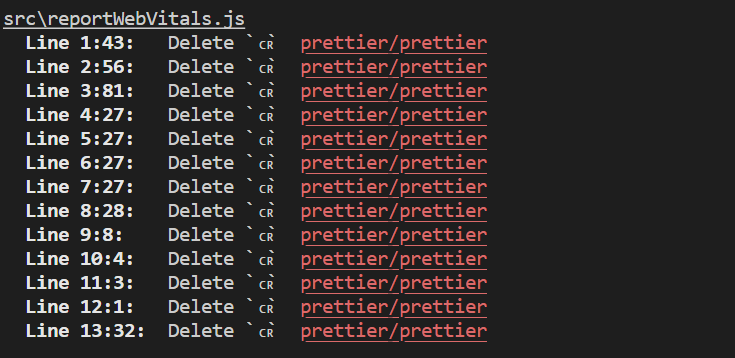
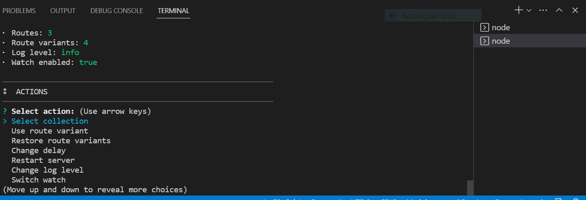
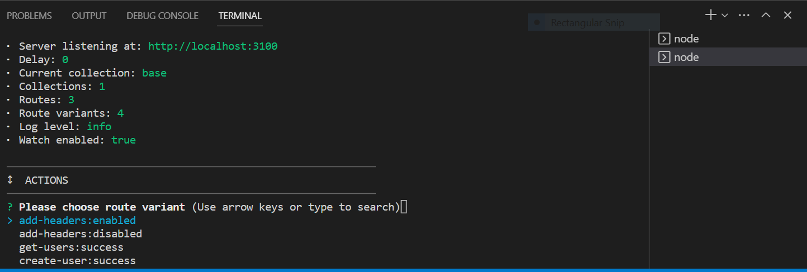

# Form page that is developed using React and Bootstrap

## How to install

Before running dev server you should install all npm dependencies

### `npm ci`

## Available Scripts

In the project directory, you can run:

### `npm start`

Runs the app in the development mode.\
Open [http://localhost:3000](http://localhost:3000) to view it in your browser.

The page will reload when you make changes.\
You may also see any lint errors in the console.

### `npm run fix`

Runs Prettire in order to format code

### `npm run lint`

Runs ESLint to analyze the code

### `npm run mocks`

Runs mock server that you can use to test POST request to submit the form

## Potential problems

If you have some problems with line separators like this -

you should stop the server and run the Prettier

### `npm run fix`

and then run the server again

### `npm run start`

## Mock server

In order to verify HTTP POST request you need to run the mock server.
Open terminal and run the following -

### `npm run mocks`

You will see the following -

Then choose `Use route variant` option

and choose `create-user:success`.
And now you can try to submit the form to get 200 status code.
